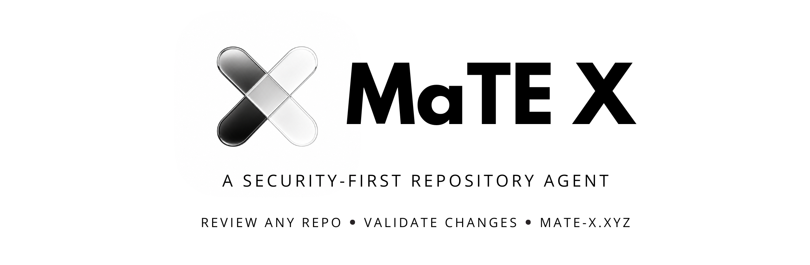

<p align="center">
  
</p>

<p align="center">
  <strong>Desktop security review agent for local repositories.</strong><br/>
  macOS and Windows. Local-first evidence. Typed Electron boundary.
</p>

<p align="center">
  <a href="https://github.com/ferxalbs/mate-x/releases"></a>
  <a href="LICENSE"></a>
  <a href="https://mate-x.xyz"></a>
</p>

MaTE X is an Electron desktop application for reviewing arbitrary local repositories with a security-first agent workflow. It opens a local codebase, classifies project surfaces, reasons over trust boundaries and data flow, produces findings with evidence, and can help generate fixes while keeping privileged operations inside the desktop main process.

The product is designed for repository security work, not generic chat over files. Analysis must separate runtime code from tests, docs, examples, generated files, scanner rules, and reference material so findings stay grounded in the code that can actually execute.

## What MaTE X Does

- Reviews local repositories for security-relevant behavior, configuration risk, dependency risk, unsafe data flow, and trust-boundary violations.
- Uses semantic classification before reporting findings: framework, runtime surface, source role, environment, entry points, sinks, and evidence confidence.
- Keeps file system access, Git operations, local persistence, API key lookup, and other sensitive actions in the Electron main process.
- Sends only deliberately prepared context to the Rainy API v3 backend after local privacy checks and redaction gates.
- Stores settings, run state, findings, and compliance artifacts locally.
- Produces local evidence packs for completed agent runs when compliance output is enabled.

## Architecture

```text
Renderer UI
  React 19, TanStack Router, TanStack Query, Zustand
        |
        | typed IPC contracts
        v
Preload boundary
        |
        v
Electron main process
  IPC handlers, validation, repository access, Git, Rainy orchestration,
  local database, privacy gates, evidence generation
        |
        +--> Local repository
        +--> libSQL / Turso local state
        +--> Rainy API v3, only through main-process services
```

| Area | Path | Responsibility |
| --- | --- | --- |
| Main process | `src/electron/` | Security-sensitive services, IPC handlers, Git integration, Rainy orchestration |
| Renderer features | `src/features/` | Product UI and feature views |
| Shared contracts | `src/contracts/` | IPC payloads, settings schemas, shared TypeScript interfaces |
| Service facades | `src/services/` | Renderer-facing service wrappers |
| State | `src/store/` | Zustand stores |
| Utilities | `src/lib/` | Shared helpers |
| UI primitives | `src/components/ui/` | Reusable UI components and colocated tests |
| Entry points | `src/main.ts`, `src/preload.ts`, `src/renderer.tsx` | Electron main, preload, renderer bootstrap |

## Security Model

MaTE X assumes the opened repository may be untrusted.

- Renderer code never receives direct file system, shell, Git, database, or secret access.
- All privileged operations cross typed IPC channels and are validated in the main process.
- Rainy API credentials are configured by the user in Settings, resolved in the main process, and must not be hardcoded, logged, or exposed to the renderer.
- Security-sensitive logic belongs in `src/electron/`.
- IPC channels follow `<domain>:<action>`, for example `repo:run-assistant`.
- Settings schema changes must update both shared contracts and database normalization.

## Privacy And Evidence

Before repository context, tool output, workspace memory, or prompts leave the machine, MaTE X applies local privacy controls. Sensitive spans should be redacted or replaced with typed placeholders before cloud model calls. Raw secret payloads must not be signed, exported, or treated as trusted evidence.

Completed agent runs may create compliance artifacts under:

```text
.mate-x/evidence/<taskId>/
```

Evidence Pack output is local-first and may include:

- `evidence-pack.json`
- `attestation.intoto.json`
- `compliance-report.pdf`
- `audit-log.json`
- `policy-applied.md`
- `agent-runbook.json`
- `agent-runbook.md`
- `manifest.json`

Agent Run Identity is persisted locally at:

```text
.mate-x/config/agent-identity.json
```

It must not be sent to Rainy API or report sinks without explicit user consent.

## Tech Stack

| Layer | Technology |
| --- | --- |
| Desktop runtime | Electron 42 |
| Renderer | React 19 |
| Styling | Tailwind CSS v4 |
| Routing | TanStack Router |
| Data fetching | TanStack Query |
| State | Zustand |
| Local database | libSQL / Turso |
| Toolchain | Bun |
| AI backend | Rainy API v3+ |

## Requirements

- Bun
- macOS 12+ on Intel or Apple Silicon, or Windows 10+
- Rainy API v3+ key configured in app Settings

Linux is not a supported target.

## Development

```bash
bun install
bun run start
```

Quality gates:

```bash
bun run lint
bun run typecheck
```

Packaging:

```bash
bun run package
bun run make
```

## License

MaTE X is source-available under the [MaTE X Licence](LICENSE). Commercial use by companies or teams requires a separate commercial licence from Enosis Labs.

## Links

- Website: [mate-x.xyz](https://mate-x.xyz)
- Enosis Labs: [enosislabs.com](https://enosislabs.com)
- Security policy: [SECURITY.md](SECURITY.md)
