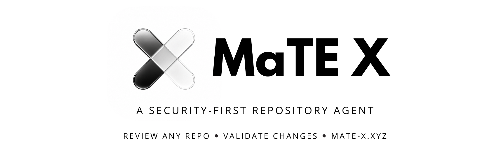

<p align="center">
  
</p>

<p align="center">
  <strong>Execution and trust runtime for AI software agents.</strong><br/>
  Connect the agent you prefer; MaTE X governs what it can do, records what happened, validates the result, and produces evidence you can inspect.
</p>

<p align="center">
  <a href="https://github.com/ferxalbs/mate-x/releases"></a>
  <a href="LICENSE"></a>
  <a href="https://mate-x.xyz"></a>
</p>

> MaTE X is the execution and trust runtime for AI software agents. Connect the agent you prefer; MaTE X governs what it can do, records what actually happened, validates the result, and produces evidence you can trust.

MaTE X is an agent-independent engineering harness and Trust Engine for local repositories. It coordinates agents, SDK-backed runtimes, repository tools, execution policy, approvals, validation, integrations, and Ship Proof through one control plane.

MaTE X is not an IDE, generic coding chatbot, code-review bot, scanner dashboard, model marketplace, or thin GUI over an LLM. It does not require users to replace Codex, OpenAI models, Rainy, Linear, or future agents. Those systems can act as integrations and execution engines under MaTE X workspace authority, approval, privacy, evidence, and validation contracts.

**v0.1.3 is an unsigned macOS Public Preview, not a stable or generally available release.** Public artifacts target native Intel x64 and Apple Silicon arm64 Macs. Windows remains architecturally supported and separately qualified; Windows and Linux are not public v0.1.3 release targets.

## Why MaTE X exists

Assistant prose cannot prove repository work succeeded. MaTE X separates requested work from executed evidence:

1. Inspect repository and active workspace state.
2. Resolve what selected behavior may attempt.
3. Apply Workspace Policy and approval requirements at execution boundary.
4. Run authorized tools and validation.
5. Record actual outputs, failures, skips, policy stops, and stale evidence.
6. Produce Ship Proof from runtime evidence rather than assistant claims.

A clean working tree is not proof. A confident response is not proof. Validation that did not run is not reported as passed.

## One harness, multiple agents

MaTE X is designed to host and coordinate different agent and SDK-backed runtimes without giving any provider direct authority over workspace policy.

- Rainy provides current cloud-backed model access and agent execution.
- OpenAI-compatible models and Responses/Chat execution paths operate behind the same MaTE X contracts.
- Codex, Cursor, and Antigravity SDK integrations are represented as user-controlled integrations.
- Linear can initiate and resume work through the canonical EngineeringTask runtime.
- Future providers can integrate without becoming a separate workflow engine or bypassing policy.

Third-party agents may reason differently. They still receive only capabilities allowed by MaTE X, and their actions remain subject to workspace scope, approvals, Privacy Firewall checks, evidence capture, and validation.

## Behavior and authorization are separate

`EngineeringTask` is the canonical workflow authority. Behavior describes how an agent approaches work; Workspace Policy defines what can change.

| Behavior | Agent behavior |
| --- | --- |
| **Review** | Read-only, evidence-backed findings and recommendations. |
| **Plan** | Read-only executable strategy based on repository evidence. |
| **Execute** | Performs and validates work allowed by current workspace authority. |

Workspace Policy independently controls paths, commands, domains, actions, and write access:

- **Read-only**: no workspace mutation.
- **Approval-required**: proposed mutations pause for explicit approval.
- **Permitted**: scoped changes may run when all other gates allow them.

Sensitive operations and Git writes remain explicit. Commit and push require user authorization in every behavior. Provider guidance, tool metadata, repository instructions, or assistant prose cannot promote their own authority.

## Runtime outcomes and Ship Proof

MaTE X carries completed, blocked, approval, and failure states through typed runtime contracts. UI does not infer success from text.

Ship Proof is reproducible result of executed work. Depending on available evidence, it records:

- repository, branch, base commit, HEAD, and diff identity;
- changed files, runtime surfaces, and risk surfaces;
- applied behavior, Workspace Policy, approvals, and policy stops;
- commands and tools that actually ran;
- passed, failed, skipped, unavailable, missing, partial, cancelled, and stale checks;
- Privacy Firewall outcome;
- provider/model metadata without provider reasoning content;
- whether commit or push remains allowed;
- proof timestamp and freshness.

Evidence Pack is richer local compliance artifact under `.mate-x/evidence/<taskId>/`, including deterministic policy identity and in-toto/SLSA-compatible attestation data when available.

## Privacy and telemetry

Repository content is treated as hostile and sensitive.

- Renderer has no direct filesystem, shell, Git, database, or credential access.
- Privileged work crosses typed preload/IPC boundaries and is validated in Electron main.
- Privacy Firewall scans outbound cloud context locally and can block sensitive transmission.
- Rainy credentials remain main-process only and are never exposed to renderer logs.
- Raw secret-bearing payloads are not signed or exported as trusted evidence.

Product telemetry is **off by default**. Users may opt in under **Settings → Privacy → Product telemetry**. Enabled telemetry uses allowlisted operation names, coarse product metadata, anonymous installation identity, and sanitized error names/codes. Prompts, responses, source code, repository paths or identity, commands, credentials, secrets, billing data, and raw stack traces are excluded. Disabling telemetry does not change product functionality.

## Performance work

Performance claims should come from runtime measurements, not adjectives. v0.1.3 work includes:

- parallel and deferred startup initialization;
- lazy loading for heavy provider, graph, privacy-model, and integration modules;
- bounded tool concurrency and single-flight refresh scheduling;
- context budgeting and semantic working-set management;
- power-aware background work and native dependency handling;
- separate native packaging and qualification for macOS Intel and Apple Silicon.

Release evidence records checks that actually ran. Packaged performance probes remain qualification tools, not blanket speed claims.

## Architecture

```text
React renderer
  conversation, settings, evidence, status
        |
        | typed window.mate IPC
        v
Preload boundary
        |
        v
Electron main process
  capability resolver + EngineeringTask runtime
  repository/filesystem/Git tools
  Rainy and SDK integrations
  Privacy Firewall
  local libSQL/Turso state
  validation + Evidence Pack + Ship Proof
```

| Area | Path | Responsibility |
| --- | --- | --- |
| Main process | `src/electron/` | Privileged services, authorization, tools, integrations, evidence |
| Renderer features | `src/features/`, `src/routes/` | Product UI and route surfaces |
| Shared contracts | `src/contracts/` | Typed IPC, settings, workflow, and evidence contracts |
| Renderer facades/state | `src/services/`, `src/store/` | Preload-facing services and UI state |
| Qualification | `qa/` | Packaged, platform, migration, and performance checks |
| Release automation | `scripts/release/`, `.github/workflows/build.yml` | Package purity, packaged E2E, artifacts, checksums, release gate |

## Install v0.1.3 unsigned Public Preview

Download artifact matching Mac architecture from [GitHub Releases](https://github.com/ferxalbs/mate-x/releases):

- `x64` for Intel Macs.
- `arm64` for Apple Silicon Macs.

Verify downloaded file against published `SHA256SUMS` file:

```bash
shasum -a 256 "/path/to/MaTE X artifact"
```

Compare full output hash with matching release checksum. Then open DMG or ZIP and move MaTE X to Applications.

Because v0.1.3 is unsigned and not notarized, macOS Gatekeeper may block first launch. Use Apple-provided approval flow; do not disable Gatekeeper:

1. Try to open MaTE X once.
2. In Finder, Control-click MaTE X and choose **Open**, then confirm **Open**; or open **System Settings → Privacy & Security** and choose **Open Anyway** for MaTE X after blocked launch.
3. Confirm only when app came from official `ferxalbs/mate-x` GitHub Release and checksum matches.

Do not use `xattr` removal, disable Gatekeeper, or lower macOS security settings.

## Updates

Native silent auto-update is disabled for unsigned preview. **Check for Updates** queries non-draft GitHub Releases and, when newer version exists, opens official release page. MaTE X never silently downloads or installs v0.1.3 updates.

Signed automatic updates can be activated only after:

1. Apple Developer Program access and Developer ID Application certificate exist.
2. Apple notarization credentials (`APPLE_ID`, app-specific `APPLE_ID_PASSWORD`, `APPLE_TEAM_ID`) are configured as protected release secrets.
3. Both Intel and Apple Silicon artifacts pass signing, notarization, stapling, ASAR purity, packaged E2E, and update-feed qualification from exact release commit.
4. Release config confirms complete credentials before enabling signing/notarization.
5. `HAS_CRYPTOGRAPHIC_KEYS` in `src/electron/updater.ts` is changed only in qualified signed release.

## Development

Requirements: Bun `1.3.14`; macOS for release qualification.

```bash
bun install --frozen-lockfile
bun run start
```

Do not use npm, pnpm, yarn, or npx for project scripts or dependency changes.

Fast iteration:

```bash
bun run test:fast
```

Full source verification:

```bash
bun run verify
```

Exact v0.1.3 release contract:

```bash
bun install --frozen-lockfile
bun run check:deprecated
bun run lint
bun run typecheck
bun run test:all
bun run verify
bun run verify:release
git diff --check
```

Dual-architecture distributables, packaged E2E evidence, ASAR purity results, and SHA-256 manifests are produced only by successful macOS release-gate jobs.

## Release documentation

- [v0.1.3 release notes](docs/release/v0.1.3-release-notes.md)
- [v0.1.3 known issues](docs/release/v0.1.3-known-issues.md)
- [v0.1.3 final checklist](docs/release/v0.1.3-final-checklist.md)
- [v0.1.3 rollback](docs/release/v0.1.3-rollback.md)
- [v0.1.3 evidence contract](docs/release/v0.1.3-release-evidence.md)

## License

MaTE X is source-available under [MaTE X Licence](LICENSE). Commercial use by companies, organizations, or teams requires separate commercial licence from Enosis Labs, Inc.

## Links

- Releases: [github.com/ferxalbs/mate-x/releases](https://github.com/ferxalbs/mate-x/releases)
- Website: [mate-x.xyz](https://mate-x.xyz)
- Enosis Labs: [enosislabs.com](https://enosislabs.com)
- Security policy: [SECURITY.md](SECURITY.md)
